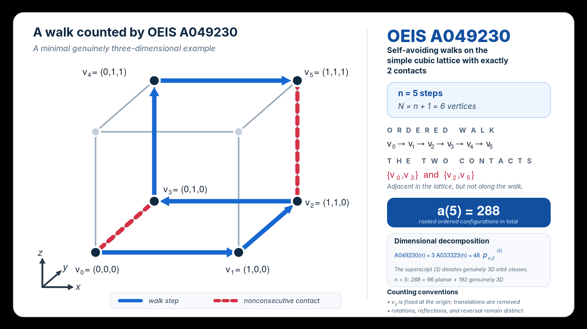

# OEIS A049230

This package accompanies an exact extension of OEIS A049230 through `a(27)`.
The sequence counts rooted ordered `n`-step self-avoiding walks on the simple
cubic lattice having exactly two nonconsecutive nearest-neighbour contacts.
Rotations and reflections are distinct, and reversal remains distinct.

The frozen C17/OpenMP campaign enumerates genuinely three-dimensional orbits
through `n=22`. Full oriented counts are reconstructed by
`A049230(n) = 3*A033323(n) + 48*p3(n)`. Exact published partition-function
coefficients continue the certified sequence from `n=23` through `n=27`.



The figure shows a minimal genuinely three-dimensional example. Blue arrows
are the five ordered walk steps; red dashed edges are the two lattice contacts
between nonconsecutive vertices.

## Main result

```text
a(19) = 2126459849880
a(20) = 9600694064496
a(21) = 43090682243160
a(22) = 192553331372616
a(23) = 856234452257592
a(24) = 3793782481788456
a(25) = 16740109801232352
a(26) = 73645193456914224
a(27) = 322845646222032480
```

Rows 19--22 are campaign reconstructions. Rows 23--27 are normalized exact
primary-source data, not outputs of the C campaign. The maximal validated
contiguous range is `n=1..27`; `n=28` is the first unresolved index within the
evidence audit dated 26 August 2026.

## Contents

```text
.gitignore                         generated and local-only exclusions
README.md                          package overview
CITATION.cff                       provisional citation metadata for v1.0
LICENSE                            MIT license
NOTICE.md                          third-party attribution and license boundary
figures/A049230_infographic.png    illustrated n=5 two-contact example
src/a049230.c                      frozen C17/OpenMP enumerator
src/Makefile                       frozen build and self-test recipe
data/b049230.txt                   canonical A049230 b-file through n=27
data/b033323.txt                   planar input used by reconstruction
data/certified_terms.tsv           terms, components, and provenance
results/a049230.tsv                campaign-derived totals through n=22
results/p3_orbits.tsv              campaign orbit counts through n=22
validation/run/manifest.tsv        byte-exact completed campaign manifest
validation/run/results.tsv         byte-exact raw campaign orbit result
validation/run.sh                  staged fail-closed public runner
validation/check_data.py           package-wide relation and identity checks
validation/check_package.py        complete public-tree and checksum audit
validation/check_blank.py          terminal-empty-record byte check
validation/derive_a049230.py       independent arithmetic reconstruction
validation/direct_oracle.py        bounded direct oriented-walk oracle
validation/orbit_oracle.py         explicit 48-image orbit oracle
validation/check_axial.py          published axial-data aggregation
validation/axial_data.txt          cited Shirai--Sakumichi data attachment
validation/p3_prefix.tsv           established orbit-count prefix
validation/prefix18.txt             historical A049230 prefix fixture
validation/joeis/Animal.java       compile-only upstream API stub
validation/joeis/A049230Verifier.java independent Java harness
validation/joeis/run_verifier.sh   pinned jOEIS fetch/build runner
validation/joeis/joeis_notes.md    jOEIS scope and execution notes
validation/validation_notes.md     evidence classes and package boundary
validation/validation_summary.md   checks executed for this raw package
validation/completion.md           campaign and endpoint completion report
validation/checksums.sha256        public-file checksum inventory
paper/A049230_v5.tex               provisional manuscript source
```

External paper/code reviews, OEIS editorial files, primary-source PDFs,
generated binaries, calibration state, and transient logs are intentionally
excluded. The machine-readable axial attachment is included because it is the
package-relative input to a manuscript validation claim; its source, scope,
attribution, and CC BY 4.0 status are recorded in `NOTICE.md` and
`validation/validation_notes.md`.

## Requirements

```text
Linux/POSIX shell environment
GCC-compatible C17 compiler with OpenMP support
GNU make
Python 3.9 or later
standard tools: awk, cmp, cp, curl, grep, mktemp, sed, sha256sum
```

A JDK with `java` and `javac` is required only for the jOEIS stage. TeX Live is
required only for the optional manuscript-source check.

## Build

From the repository root:

```sh
make -C src all
```

The frozen Makefile also provides `make -C src test`. That bounded regression
uses temporary durable-state operations. It is public and reproducible, but it
is separate from the read-only quick package check below.

## Public validation

Fast, fail-closed checks that do not advance a campaign state:

```sh
sh validation/run.sh quick
```

This builds the copied source, replays `p3(1..8)`, runs two bounded Python
oracles, audits the complete public-tree inventory and checksums, verifies the
archived 2411-unit campaign state read-only, reconstructs `a(1..22)`, checks
the published checkpoints and Crippen values, aggregates the axial data, and
removes the generated executable.

The provisional TeX source can be compiled twice without producing a PDF:

```sh
sh validation/run.sh paper
```

The independent jOEIS reproduction is a separate long stage:

```sh
sh validation/run.sh joeis
```

It downloads hash-pinned upstream sources, requires network access, has no
checkpoint, and reproduces `a(19)=2126459849880` by a separate Java
implementation. A fresh public-wrapper run on 26 August 2026 passed in 3189
seconds of verifier time on the documented workstation. Do not run two
instances concurrently.

## Production command shape

The archived campaign used the following configuration:

```sh
src/a049230 init --state A049230_run --max-n 22 --threads 8 --split-depth 10 --unit-size 64 --segment-seconds 4500
src/a049230 next --state A049230_run
src/a049230 status --state A049230_run
src/a049230 verify --state A049230_run --p3-file validation/p3_prefix.tsv
```

`next` was invoked by the human operator once per segment. These commands
document the archived workflow; they are not instructions to restart or extend
the completed campaign. The public state is under `validation/run/`.

## Campaign summary

The deterministic depth-10 frontier contains `154271` prefix tasks grouped
into `2411` recovery units. The completed 8-thread campaign used three operator
segments. Its authoritative accumulated per-unit wall time is `10232`
seconds. Hardware and software details are in the manuscript and validation
notes.

## Data formats

`data/b049230.txt` and `data/b033323.txt` use canonical space-separated
`n value` rows without headers. Each ends with exactly one empty final record.

The headed publication tables `data/certified_terms.tsv`,
`results/a049230.tsv`, and `results/p3_orbits.tsv` are tab-separated. The
certified table has the columns
`n a_n A033323_n p3_orbits provenance`. Its provenance labels distinguish the
historical OEIS prefix, campaign rows, the Lee--Kim--Lee row, and the
Hsieh--Chen--Hu rows.

`results/p3_orbits.tsv` is a headed publication view of the raw program output
stored at `validation/run/results.tsv`. `results/a049230.tsv` contains the
corresponding full counts through the campaign endpoint. The frozen program's
raw `validation/run/results.tsv` and the historical fixture
`validation/p3_prefix.tsv` retain their original canonical space-separated
`n value` grammar despite their legacy `.tsv` suffixes.

## Paper and citation state

The provisional manuscript is `paper/A049230_v5.tex`. No PDF is included.
Use `CITATION.cff` for citation metadata. The intended repository URL is
`https://github.com/carcorti/A049230`; version `v1.0` and the Zenodo DOI are
provisional. The literal DOI `10.5281/zenodo.xxxxxxxx` remains an intentional
placeholder until Carlo Corti supplies the verified archive locator.

Original repository software and supporting material are distributed under
the MIT License; see `LICENSE`. The third-party axial data file remains under
CC BY 4.0 and is not relicensed under MIT; see `NOTICE.md`.
